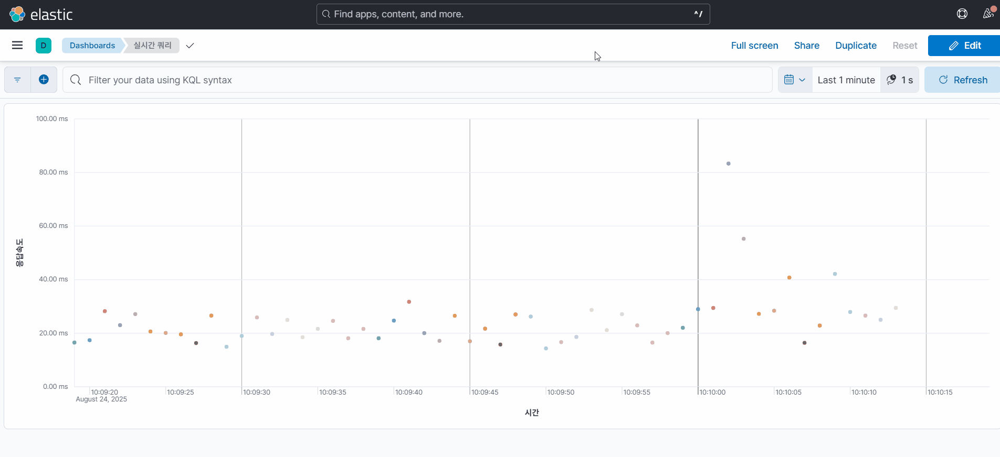
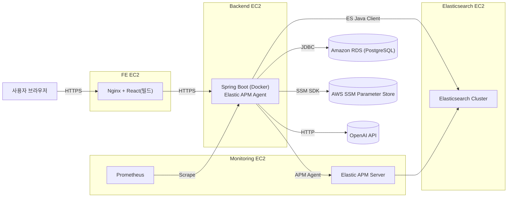

## 상품검색 및 검색관리 데모

#### 프로젝트 개요   
-  다나와에서 카테고리별로 수집한 87,223건의 상품을 Elasticsearch 에 색인하여 검색 페이지 및 관리도구를 구현하였습니다
- 상품 검색 페이지 : http://fe.hihisososo.link/search-demo
- 검색 관리 페이지 : http://fe.hihisososo.link/dashboard
- 쿼리 모니터링 : [바로가기](http://es.hihisososo.link:5601/app/dashboards#/view/77278e84-60b0-48cd-85c1-d2cd90dd2390?_g=(filters:!()))

  <table>
    <tr>
      <td align="center" width="33%">
        <b>상품검색</b>  
        
      </td>
      <td align="center" width="33%">
        <b>동의어사전 적용</b>  
        
      </td>
      <td align="center" width="33%">
        <b>카테고리랭킹 적용</b>  
        
      </td>
    </tr>
  </table>
  <table>
    <tr>
      <td align="center" width="33%">
        <b>검색 모니터링</b>  
        
      </td>
      <td align="center" width="33%">
        <b>색인 및 배포</b>  
        
      </td>
      <td align="center" width="33%">
        <b>검색 평가</b>  
        
      </td>
    </tr>
  </table>

#### 특징
- 관리 페이지를 통해 실 반영 전 미리 색인 -> 검색 테스트 -> 배포 할 수 있게 기획하였습니다
- 사용자/동의어/불용어/오타교정/카테고리랭킹 등 사전 기능을 통해 검색 품질을 높일 수 있습니다
- LLM + 사람 검수를 통한 정답셋을 만들고, 평가 결과 확인을 통해 검색 품질을 높였습니다

#### 서버 구성

#### 주요 기능 상세 설명
- [상품검색](./docs/product-search.md) : 상품 검색 구현 설명입니다
- [사전관리](./docs/dictionary-management.md) : 사전 관리 구현 설명입니다
- [배포관리](./docs/deployment-management.md) : 색인 수행 및 배포에 대한 구현 설명입니다
- [검색평가](./docs/search-evaluation.md) : LLM 1차 평가를 통한 검색 품질 평가 구현 설명입니다

#### 기술 스택

- 백엔드
  - Spring Boot 3.5.3, Spring Data JPA, Java 17, Gradle
  - PostgreSQL 17.4
  - Elasticsearch 8.18.3
  - OpenAI API

- FE
  - React, TypeScript (별도 리포지토리)

- 인프라/CI·CD
  - Github Action
  - AWS (EC2/SSM)
  - Docker

- 모니터링
  - Grafana, Prometheus
  - Elasticsearch APM

