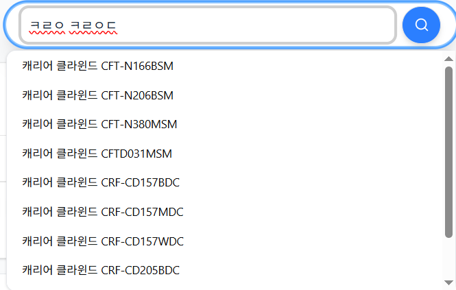
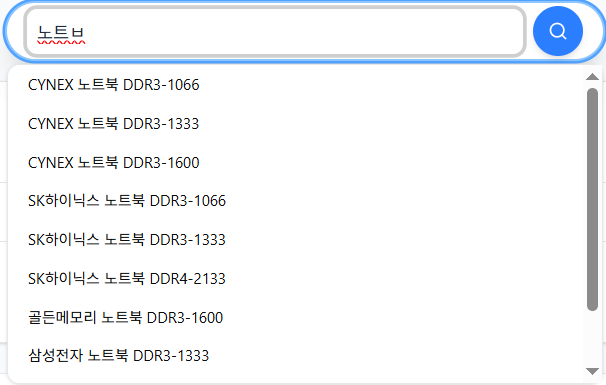
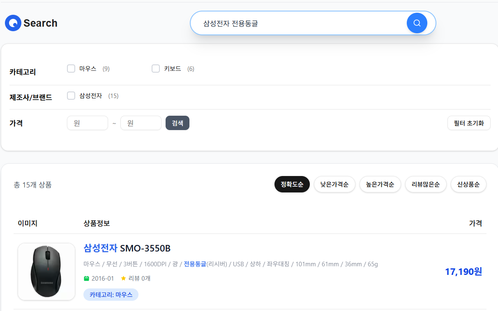

## 상품 검색 기능

### 자동완성 구현 내용입니다

- 기능정의
  - "ㄴㅌㅂ" 과 같이 초성으로도 검색 되어야 함
  - "노트ㅂ" 과 같이 자소단위 일치 검색 되어야 함
  - "삼성노트북" 과 같이 띄어쓰기 불일치 경우에도 검색 되어야 함
  - "노트북삼성" 과 같은 순서가 뒤바뀐 검색어도 검색 되어야 함
- 구현
  - 초성검색 처리를 위해 초성 변환필드 추가하였습니다
  - 자소검색 처리를 위해 자소 변환필드 추가하였습니다
  - 띄어쓰기 불일치 처리를 위해 공백제거 필드 추가하였습니다
  - 순서가 뒤바뀐 검색어 처리를 위해 형태소 분석 필드 추가하였습니다
- Elasticsearch 세팅 및 필드 설정
    
    ```json
    {
      "index": {
        "number_of_shards": "1",
        "number_of_replicas": "0",
        "analysis": {
          "filter": {
            "edge_ngram_filter": {
              "type": "edge_ngram",
              "min_gram": 1,
              "max_gram": 50
            }
          },
          "tokenizer": {
            "userdic_nori_tokenizer": {
              "type": "nori_tokenizer",
              "user_dictionary": "{USER_DICT_PATH}",
              "decompound_mode": "mixed"
            }
          },
          "analyzer": {
            "edge_ngram_analyzer": {
              "type": "custom",
              "tokenizer": "whitespace",
              "filter": [
                "edge_ngram_filter"
              ]
            },
            "edge_ngram_search_analyzer": {
              "type": "custom",
              "tokenizer": "whitespace"
            },
            "nori_analyzer": {
              "type": "custom",
              "tokenizer": "userdic_nori_tokenizer"
            }
          }
        }
      }
    }
    ```
    
    ```json
    {
      "properties": {
        "name": {
          "type": "keyword"
        },
        "name_jamo": {
          "type": "text",
          "analyzer": "edge_ngram_analyzer",
          "search_analyzer": "edge_ngram_search_analyzer"
        },
        "name_jamo_no_space": {
          "type": "text",
          "analyzer": "edge_ngram_analyzer",
          "search_analyzer": "edge_ngram_search_analyzer"
        },
        "name_chosung": {
          "type": "text",
          "analyzer": "edge_ngram_analyzer", 
          "search_analyzer": "edge_ngram_search_analyzer"
        },
        "name_nori": {
          "type": "text",
          "analyzer": "nori_analyzer"
        }
      }
    }
    ```
    
- 아래와 같이 어플리케이션 단에서 데이터를 가공하여 색인하였습니다
    
    ```json
    {
      "name": "휘릭 FR-AIR01",
      "name_jamo": "ㅎㅟㄹㅣㄱ fr-air01",
      "name_jamo_no_space": "ㅎㅟㄹㅣㄱfr-air01",
      "name_chosung": "ㅎㄹ fr-air01",
      "name_nori": "휘릭 fr-air01"
    }
    ```
    
- 실제 검색 예시
    
    
    
    
    
    

### 상품검색

- 기능 정의
  - 상품명+카테고리+스펙(상세설명) 에서 검색 되어야 합니다
  - 상품명 에서 일치했을 경우, 우선순위가 높아야 합니다
  - 모델명은 일부만 검색해도 검색되어야 합니다
- 구현
  - 상품명, 스펙 각각 형태소분석, 바이그램 필드 추가하였습니다
  - 모델명은 추가 추출하여 바이그램 필드로 추가하였습니다
- 검색 조건 및 우선순위(부스팅)
  - 1순위 : 상품명(형태소분석), 스펙(형태소분석), 모델명(바이그램) 을 cross_field 로 검색되게 하였습니다
  - 2순위 : 상품명(바이그램) + 스펙(바이그램) 을 cross_field 검색되게 하였습니다
  - 검색어에서 카테고리, 브랜드 일치할 경우 추가 부스팅하였습니다
- Elasticsearch 필드 설정
    
    ```json
    {
      "index": {
        "analysis": {
          "filter": {
            "search_synonym_filter": {
              "type": "synonym_graph",
              "updateable": "true",
              "synonyms_set": "{SYNONYM_SET_NAME}"
            },
            "stopword_filter": {
              "type": "stop",
              "stopwords_path": "{STOPWORD_DICT_PATH}"
            },
            "pos_filter": {
              "type": "nori_part_of_speech",
              "stoptags": [
                "J", "E", "IC", "SF", "SP", "SC", "SE",
                "XPN", "XSA", "XSN", "XSV", "SSO", "SSC", "UNA", "NA", "VSV"
              ]
            }
          },
          "analyzer": {
            "nori_index_analyzer": {
              "filter": ["pos_filter", "stopword_filter"],
              "type": "custom",
              "tokenizer": "userdic_nori_tokenizer"
            },
            "bigram_analyzer": {
              "type": "custom",
              "tokenizer": "bigram_tokenizer"
            },
            "nori_search_analyzer": {
              "filter": ["pos_filter", "search_synonym_filter", "stopword_filter"],
              "type": "custom",
              "tokenizer": "userdic_nori_tokenizer"
            }
          },
          "tokenizer": {
            "bigram_tokenizer": {
              "type": "ngram",
              "min_gram": "2",
              "max_gram": "2"
            },
            "userdic_nori_tokenizer": {
              "type": "nori_tokenizer",
              "user_dictionary": "{USER_DICT_PATH}",
              "decompound_mode": "mixed"
            }
          }
        }
      }
    } 
    ```
    
    ```json
    {
      "properties": {
        "id": {
          "type": "long"
        },
        "brand_name": {
          "type": "keyword"
        },
        "category_id": {
          "type": "long",
          "index": false
        },
        "category_name": {
          "type": "keyword"
        },
        "specs": {
          "type": "text",
          "fields": {
            "bigram": {
              "type": "text",
              "analyzer": "bigram_analyzer"
            }
          },
          "analyzer": "nori_index_analyzer",
          "search_analyzer": "nori_search_analyzer"
        },
        "specs_raw": {
          "type": "keyword",
          "index": false
        },
        "model": {
          "type": "keyword",
          "fields": {
            "bigram": {
              "type": "text",
              "analyzer": "bigram_analyzer"
            }
          }
        },
        "name": {
          "type": "text",
          "fields": {
            "bigram": {
              "type": "text",
              "analyzer": "bigram_analyzer"
            }
          },
          "analyzer": "nori_index_analyzer",
          "search_analyzer": "nori_search_analyzer"
        },
        "name_raw": {
          "type": "keyword",
          "index": false
        },
        "content_vector": {
          "type": "dense_vector",
          "dims": 1536,
          "index": true,
          "similarity": "cosine"
        },
        "price": {
          "type": "long"
        },
        "reg_month": {
          "type": "date",
          "format": "yyyy-MM"
        },
        "review_count": {
          "type": "integer"
        },
        "rating": {
          "type": "float"
        },
        "thumbnail_url": {
          "type": "keyword",
          "index": false
        }
      }
    }
    ```
    
- 실제 검색 내용
    
    