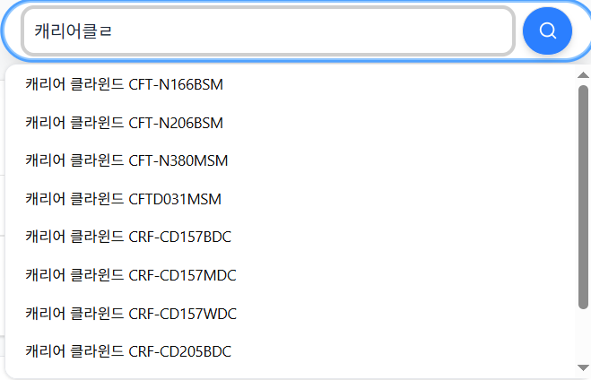

## 상품 검색 기능

### 자동완성 구현 내용입니다

- 기능정의
  - "ㄴㅌㅂ" 과 같이 초성으로도 검색 되어야 함
  - "노트ㅂ" 과 같이 자소단위 일치 검색 되어야 함
  - "삼성노트북" 과 같이 띄어쓰기 불일치 경우에도 검색 되어야 함
  - "노트북삼성" 과 같은 순서가 뒤바뀐 검색어도 검색 되어야 함
- 구현
  - 초성검색 처리를 위해 초성 변환필드 추가하였습니다
  - 자소검색 처리를 위해 자소 변환필드 추가하였습니다
  - 띄어쓰기 불일치 처리를 위해 공백제거 필드 추가하였습니다
  - 순서가 뒤바뀐 검색어 처리를 위해 형태소 분석 필드 추가하였습니다
- Elasticsearch 세팅 및 필드 설정
    
    ```json
    {
      "index": {
        "number_of_shards": "1",
        "number_of_replicas": "0",
        "analysis": {
          "filter": {
            "edge_ngram_filter": {
              "type": "edge_ngram",
              "min_gram": 1,
              "max_gram": 50
            }
          },
          "tokenizer": {
            "userdic_nori_tokenizer": {
              "type": "nori_tokenizer",
              "user_dictionary": "{USER_DICT_PATH}",
              "decompound_mode": "mixed"
            }
          },
          "analyzer": {
            "edge_ngram_analyzer": {
              "type": "custom",
              "tokenizer": "whitespace",
              "filter": [
                "edge_ngram_filter"
              ]
            },
            "edge_ngram_search_analyzer": {
              "type": "custom",
              "tokenizer": "whitespace"
            },
            "nori_analyzer": {
              "type": "custom",
              "tokenizer": "userdic_nori_tokenizer"
            }
          }
        }
      }
    }
    ```
    
    ```json
    {
      "properties": {
        "name": {
          "type": "keyword"
        },
        "name_jamo": {
          "type": "text",
          "analyzer": "edge_ngram_analyzer",
          "search_analyzer": "edge_ngram_search_analyzer"
        },
        "name_jamo_no_space": {
          "type": "text",
          "analyzer": "edge_ngram_analyzer",
          "search_analyzer": "edge_ngram_search_analyzer"
        },
        "name_chosung": {
          "type": "text",
          "analyzer": "edge_ngram_analyzer", 
          "search_analyzer": "edge_ngram_search_analyzer"
        },
        "name_nori": {
          "type": "text",
          "analyzer": "nori_analyzer"
        }
      }
    }
    ```
    
- 아래와 같이 어플리케이션 단에서 데이터를 가공하여 색인하였습니다
    
    ```json
    {
      "name": "캐리어 ARC06FAR",
      "name_jamo": "ㅋㅐㄹㅣㅇㅓ arc06far",
      "name_chosung": "ㅋㄹㅇ arc06far",
      "name_nori": "캐리어 arc06far",
      "name_jamo_no_space": "ㅋㅐㄹㅣㅇㅓarc06far"
    }
    ```
    
- 실제 검색 예시
    
    
    
    
    
    

### 상품검색

- 기능 정의
  - 상품명/카테고리/스펙(상세설명) 에서 검색 되어야 합니다
  - 상품명/카테고리 에서 일치했을 경우 스펙에서 일치했을때보다, 우선순위가 높아야 합니다
  - 모델명은 일부만 검색해도 검색되어야 합니다
  - 1kg 같은 단위명은 동치 단위로도 검색 되어야 합니다 ex) 1l -> 1리터 등으로도 검색 되어야 함
  - 사전을 통해 검색결과 조정이 가능해야 합니다
  - 형태소 분석 검색 결과가 없을 경우, 유사문서(벡터)검색으로 폴백되어야 합니다
- 구현 특이사항
  - 소수점 : 노리 형태소분석기는, 1.5 와 같은 소수점을 1,.,5 와 같이 개별 토큰으로 나누므로 5 만 검색해도 검색되게 되어. 커스텀 token filter 를구현하여 소수점 단위로 추청되는 것은 붙이도록 했습니다
  - 단위명 : 1kg, 1g 등 단위명으로 판별되는 단어는 색인시, 단위명동치(ex 10킬로그램, 10그램) term 을 추가로 색인하여 동치단위명, 숫자로도 검색되게 했습니다
  - 그 외, 검색 정밀도를 위해 특문제거, 천단위 구분자 제거 등 상품명 전처리를 수행했습니다 
  - 벡터 임베딩 생성시, [MTEB](https://huggingface.co/spaces/mteb/leaderboard) , [Kor-IR](https://github.com/Atipico1/Kor-IR) 참고하여 간단하게 오픈된 API 로 간단히 이용할 수 있는 업스테이지 임베딩을 선택했습니다

- 구현
  - 상품명/카테고리/스펙 형태소분석필드 추가하였습니다
  - 상품명/스펙 벡터 필드 추가하였습니다.
  - 동의어는 synonym_graph 를 통해 검색시 확장하도록 하였습니다
- 검색 조건 및 부스팅
  - 키워드 검색
    - 상품명/스펙/모델명을 cross_field 로 검색되게 하였습니다
    - 부스팅 : phrase 쿼리로 인접한 term 에 가중치를 부여했습니다
  - 벡터 검색
    - 스코어 0.6 이상, 상품명 가중치 0.7, 스펙 가중치 0.3 을 할당하였습니다
- mapping 일부
    
    ```json
    "name": {
      "type": "text",
      "analyzer": "nori_index_analyzer",
      "search_analyzer": "nori_search_analyzer",
      "fields": {
        "bigram": {
          "type": "text",
          "analyzer": "bigram_analyzer"
        }
      }
    },
    "specs": {
      "type": "text",
      "analyzer": "nori_index_analyzer",
      "search_analyzer": "nori_search_analyzer",
      "fields": {
        "bigram": {
          "type": "text",
          "analyzer": "bigram_analyzer"
        }
      }
    },
    "category": {
      "type": "text",
      "analyzer": "nori_index_analyzer",
      "search_analyzer": "nori_search_analyzer",
      "fields": {
        "bigram": {
          "type": "text",
          "analyzer": "bigram_analyzer"
        }
      }
    },
    "name_vector": {
      "type": "dense_vector",
      "dims": 4096,
      "index": true,
      "similarity": "cosine"
    },
    "specs_vector": {
      "type": "dense_vector",
      "dims": 4096,
      "index": true,
      "similarity": "cosine"
    },
    ```
- setting 일부
    ```json
    "analysis": {
      "char_filter": {
        "remove_spaces": {
          "type": "pattern_replace",
          "pattern": "\\s+",
          "replacement": ""
        }
      },
      "filter": {
        "search_synonym_filter": {
          "type": "synonym_graph",
          "updateable": "true",
          "synonyms_set": "{SYNONYM_SET_NAME}"
        },
        "stopword_filter": {
          "type": "stop",
          "stopwords_path": "{STOPWORD_DICT_PATH}"
        },
        "pos_filter": {
          "type": "nori_part_of_speech",
          "stoptags": [
            "J", "E", "SP", "SC", "SE",
            "XPN", "XSA", "XSN", "XSV", "SSO", "SSC", "UNA", "NA", "VSV"
          ]
        },
        "decimal_unit_merge_index": { // 소수점병합 + 단위판단 커스텀 token filter
          "type": "decimal-unit-merge",
          "mode": "index",
          "units_path": "{UNIT_DICT_PATH}"
        },
        "decimal_unit_merge_search": { // 소수점병합 + 단위판단 조합 커스텀 token filter
          "type": "decimal-unit-merge",
          "mode": "search",
          "units_path": "{UNIT_DICT_PATH}"
        }
      },
      "analyzer": {
        "nori_index_analyzer": {
          "filter": ["decimal_unit_merge_index", "pos_filter", "stopword_filter"],
          "type": "custom",
          "tokenizer": "userdic_nori_tokenizer"
        },
        "nori_search_analyzer": {
          "filter": ["decimal_unit_merge_search", "pos_filter", "stopword_filter", "search_synonym_filter"],
          "type": "custom",
          "tokenizer": "userdic_nori_tokenizer"
        }
        ...
      },
      "tokenizer": {
        "userdic_nori_tokenizer": {
          "type": "nori_tokenizer",
          "discard_punctuation": false,
          "user_dictionary": "{USER_DICT_PATH}",
          "decompound_mode": "discard"
        }
        ...
      }
    }
  }
    ```
- 검색 쿼리 DSL (키워드)
  ```
  "query": {
    "bool": {
      "must": [
        {
          "bool": {
            "must": [
              {
                "multi_match": {
                  "boost": 1,
                  "auto_generate_synonyms_phrase_query": false,
                  "fields": [
                    "name^3.0",
                    "specs^1.0",
                    "category^3.0"
                  ],
                  "operator": "and",
                  "query": "캐리어",
                  "type": "cross_fields"
                }
              }
            ],
            "should": [
              {
                "multi_match": {
                  "boost": 1,
                  "fields": [
                    "name",
                    "specs",
                    "category"
                  ],
                  "minimum_should_match": "2",
                  "query": "캐리어",
                  "slop": 10,
                  "type": "phrase"
                }
              }
            ]
          }
        }
      ]
    }
  }
  ```
- 검색 쿼리 DSL (벡터)
  ```
  {
  "knn": [
    {
      "field": "name_vector",
      "query_vector": [...],
      "k": 300,
      "num_candidates": 900,
      "boost": 0.699999988079071
    },
    {
      "field": "specs_vector",
      "query_vector": [],
      "k": 300,
      "num_candidates": 900,
      "boost": 0.30000001192092896
    }
  ],
  "min_score": 0.7,
  "size": 300
  }
  ```
- 실제 검색 내용(키워드)
    
- 폴백 검색 내용(벡터)
    