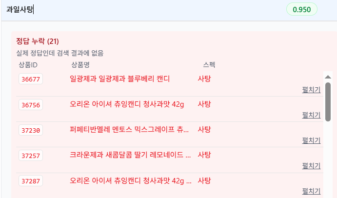
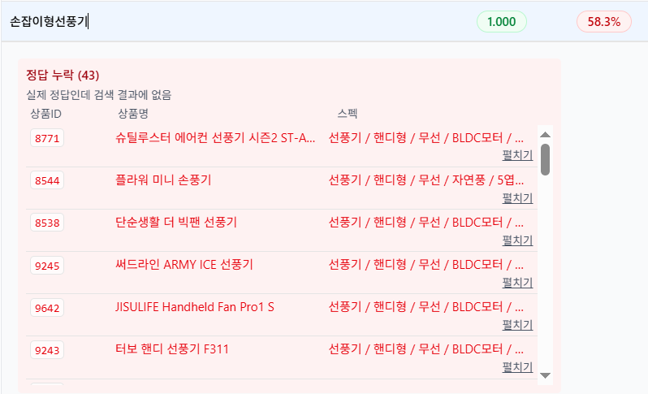
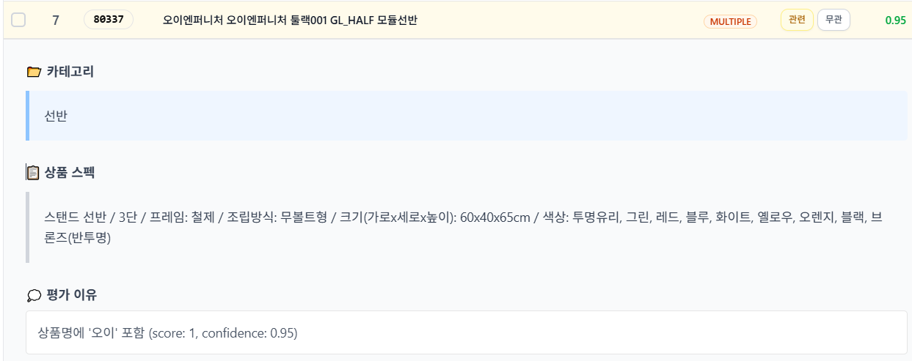

## 검색평가

#### 개요
- 검색 품질을 테스트해보기 위해 오프라인 평가를 구현 하였습니다
- Precision, Recall 평가하도록 구현하였고, LLM 을 통해 1차평가 + 2차 개인적으로 평가하였습니다
- Precision, Recall 로 평가하도록 한 이유는 아래와 같습니다
  - 유저 데이터가 없으므로, 유저 데이터 기반 평가가 불가합니다
  - NDCG 처럼 검색된 문서에 연관도 점수를 차등 부여하는 방식은, LLM 자동 평가시, 잘못 평가되는 경우가 많았습니다
- LLM 자동평가에는 GPT-5-nano 를 사용하였습니다
- LLM 평가 후, 잘못평가된 부분은 2차 검수하였습니다

#### 평가셋 생성 
- 평가를 위해 쿼리 <-> 정답문서 세트가 필요합니다
- 동일한 쿼리에 대해 실제검색(형태소)/바이그램/벡터 방식으로 질의해서 정답 후보군을 가져오도록 하여 실제 검색에서의 놓친 문서를 찾을 수 있도록 고려하였습니다
- 평가 리소스 부족으로, 총 검색 결과 500개 이하의 작은 쿼리만 수행하였습니다
- 쿼리는 각 카테고리별 2개(총100개) 선별하였습니다
- [평가 프롬프트](../src/main/resources/prompts/bulk-product-relevance-evaluation.txt)
  
#### 개선점
- 아래와 같이 실검색에서 놓친 문서와, 동의어 등록 후보군들을 확인할 수 있었습니다
  - 놓친 문서 예
    
    
    
  - 동의어 등록 후보
    
    
#### 한계점
- 평가 일관성이 부족하며, 잘못된 평가를 내리는 부분도 상당수 존재하였습니다
  - "오이" 검색시 잘못된 평가
    
    

#### 평가 결과 및 분석 
  - 키워드검색 : precision@20 : 0.935, recall@300 : 0.865
  - 하이브리드 : precision@20 : 0.942, recall@300 : 0.942
  - precision, recall 이 굉장히 높게 나왔습니다. 이유를 분석해보면, 단순 키워드위주의 문서 특성, 각 분석기별 결과를 pooling 한것을 평가셋으로 삼아 정답이 검색될 확률이 매우 높음, 실검색 쿼리 미반영의 영향으로 보입니다
  - 절대적인 평가 지표보다는, 검색 방식별 비교우위 및 놓친 문서를 찾는데 활용이 가능할 것으로 보입니다

#### 참고 문서
  - https://www.elastic.co/search-labs/blog/evaluating-search-relevance-part-2
  - https://www.dei.unipd.it/~ferro/papers/2024/IR-Book2024-FM.pdf
  - https://www.kci.go.kr/kciportal/landing/article.kci?arti_id=ART002899961